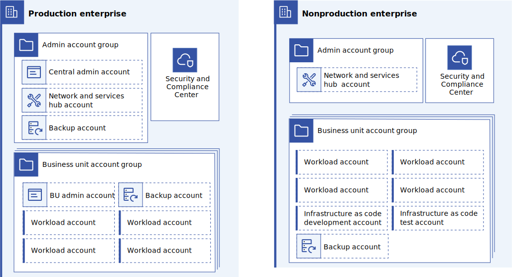

---

copyright:
  years: 2023
lastupdated: "2023-11-15"

subcollection: adopt-enterprise-architecture

keywords:

---

{{site.data.keyword.attribute-definition-list}}

# Assessing existing resources and workloads
{: #assess}

Before you determine an adoption strategy, build an inventory of existing resources and workloads.
{: shortdesc}

This inventory might include catalog resources like clusters, databases, and other services, but also include things like access policies and account settings. Then, assess the inventory to determine how the existing resources and workloads would fit into the [recommended account structure](/docs/enterprise-account-architecture?topic=enterprise-account-architecture-account-structure).

{: caption="Figure 1. Recommended account structure" caption-side="bottom"}

1. Locate accounts and workloads that need to be moved. Make sure that all resources are allocated, as missed resources cause problems later on. Use billing records to locate all {{site.data.keyword.cloud_notm}} accounts that potentially contain resources. Use [global search](/docs/account?topic=account-ibmcloud_commands_resource&interface=ui#ibmcloud_resource_search) to locate resources within accounts and record them.
1. Logically partition the existing resources into groups by architecture, sensitivity, automation, and so on. Then, subgroup these resources based on where they fall in the [enterprise architecture account structure](/docs/enterprise-account-architecture?topic=enterprise-account-architecture-account-structure). Be sure to include groups for network infrastructure, common services, backups, nonproduction and production workloads, and so on, as including these groups eases reasoning about the transition.
1. Take note of key factors that influence adoption strategies. Some key factors include types of data storage (and resulting data migration capabilities), availability requirements for applications (and possibility for scheduled downtime), business criticality of applications, scale, and complexity.
1. Delete unneeded resources or mark them as unneeded by using tags. Don't waste effort on unneeded resources or workloads. The Resource Explorer can help you find unused catalog resources and Identity and Access Management can help you find unused security resources.
