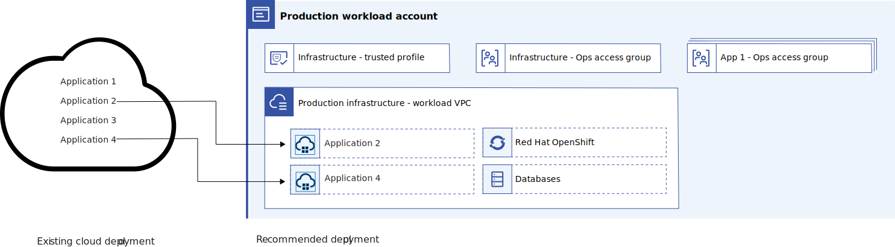
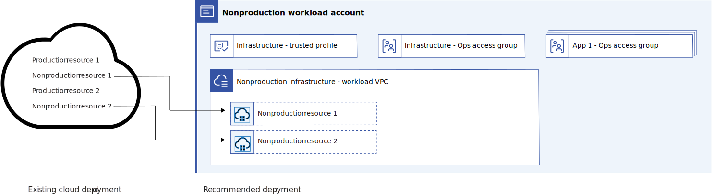
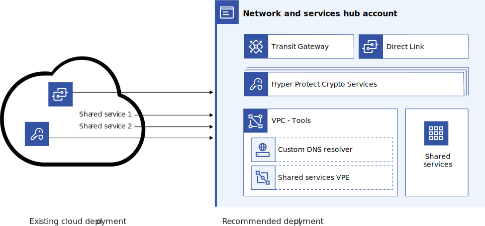
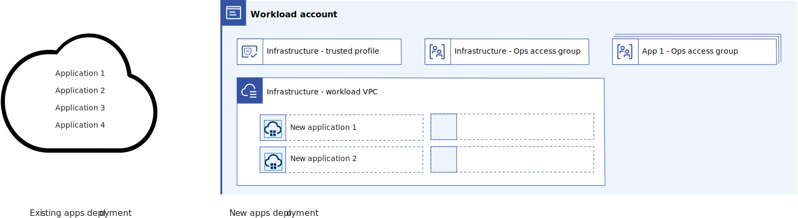
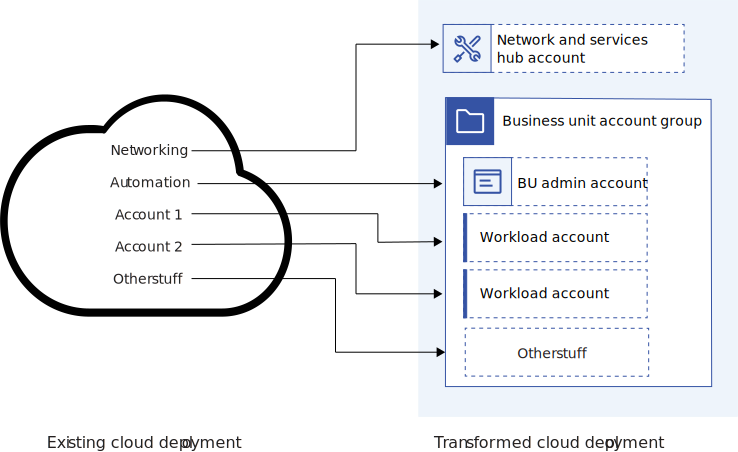
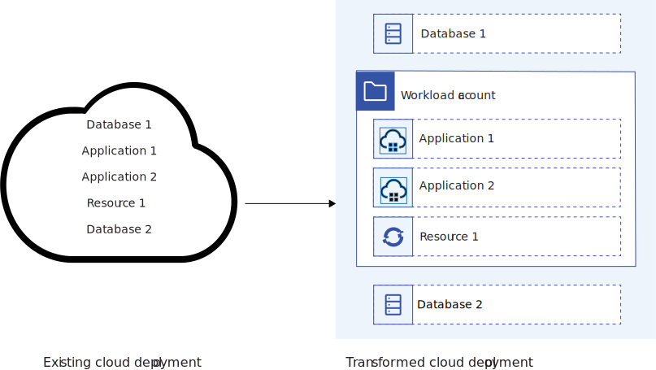

---

copyright:
  years: 2023
lastupdated: "2023-11-15"

subcollection: adopt-enterprise-architecture

keywords:

---

{{site.data.keyword.attribute-definition-list}}

# Implementing transition strategies
{: #migrate}

Implement one or more of the technical strategies to adopt the enterprise architecture. The pros and cons of each strategy are included.
{: shortdesc}

## App by app migration
{: #app-app}

With this strategy, a single application or family of related applications is migrated to a set of workload accounts, which exist in parallel with the existing infrastructure for the application. After the migration is complete, unused infrastructure in the original accounts can be decommissioned.

{: caption="Figure 1. App by app migration" caption-side="bottom"}

1. Select a workload for migration and add related resources to a project in preparation for tracking resources during migration.
1. Update the workload as needed to make it configurable and able to run in all locations. These updates might involve code changes to parameterize hostnames, URLs, IP addresses, and ports.
1. Deploy infrastructure as needed in the [nonproduction and production workload](/docs/enterprise-account-architecture?topic=enterprise-account-architecture-infra-account) accounts by deploying architectures from projects that are hosted in the [business unit hub account](/docs/enterprise-account-architecture?topic=enterprise-account-architecture-bu-admin-account). Ensure that appropriate access, networking, and dependencies are in place as part of the infrastructure setup.
1. Configure delivery pipelines to deploy the application to both the original and new infrastructure such that application deployment is synchronized in both environments.
1. Migrate data by backing up, restoring, and syncing all related data from the original data storage or service. If periodically migrating data, this step might need to be repeated before applications are activated on the new infrastructure.
1. Test the new deployment, update the infrastructure and application, and return to step 2 or 3 as needed.
1. Activate applications on the new infrastructure. For example, update DNS records and load balancer. Consider routing only a percentage of traffic to start if data can be synced live. Ensure that a failback is available in case issues occur.
1. Decommission any unused resources from the original deployment. Use the project configuration from the preparation phase to help locate these resources and complete bulk operations.

This strategy is low risk and gains all of the cost and operation savings that are associated with shared infrastructure and IaC managed workload accounts. Using parallel infrastructure allows for a smooth transition and easy failback should problems occur. However, this approach does temporarily double infrastructure costs and can be slow to run. Also, data sync and infrastructure migration can be difficult. In addition, data services encrypted with BYOK might have extra concerns with migration. For more information about data migration, see [relevant capabilities](#capabilities). Despite these drawbacks, this workload migration strategy is likely the best for most organizations.
{: note}

## Piecemeal migration (nonproduction)
{: #piecemeal-non-production}

With this strategy, [nonproduction workloads](/docs/enterprise-account-architecture?topic=enterprise-account-architecture-infra-account) are moved into separate workload accounts.

{: caption="Figure 2. Piecemeal migration of nonproduction resources" caption-side="bottom"}

Options:
* Use the same process as [app by app migration](#app-by-app-migration), but migrate only nonproduction workloads.  Because nonproduction workloads don't typically have critical data, it might not be necessary to migrate data and even if it is, a period of downtime during the migration can often be much easier to manage.
* Bulk migrate your nonproduction workloads to new infrastructure. This is a similar process to [app by app migration](#app-by-app-migration), but the infrastructure for a group of nonproduction workloads is deployed and those workloads are switched to deploy to that infrastructure all together. Bulk migration is most appealing if data migration is not required.

Migrating nonproduction workloads into a separate account from production workloads provides an important separation of concerns, making it easier to ensure that users and processes don't accidentally operate against the wrong data or service. Moving only nonproduction workloads eases data migration concerns and further reduces risk as production isn't touched. This strategy works well combined with [Transform in place](#transform-in-place) for the production workloads.
{: note}

## Piecemeal migration (networking and shared services)
{: #piecemeal-network}

{: caption="Figure 3. Piecemeal migration of network and shared services" caption-side="bottom"}

With this strategy, [networking and shared services](/docs/enterprise-account-architecture?topic=enterprise-account-architecture-hub-account) are set up in a new account and then linked to existing workload accounts, which creates a hybrid architecture. This strategy works well with [piecemeal migration of nonproduction](#piecemeal-migration-non-production) and isn't required when using [app-by-app migration](#app-by-app-migration) as a duplicate set of these services can be used instead.

1. Add any existing networking and shared services to appropriate projects in the central administrative account in preparation for tracking resources during the migration.
1. Deploy new networking and shared services in the new network and services hub account according to the enterprise architecture. You must also assign appropriate access.
1. [Export transit gateway](/docs/transit-gateway?topic=transit-gateway-ha-dr#disaster-recovery) information and [direct link](/docs/dl?topic=dl-ha-dr#disaster-recovery-dl) information from any existing deployment of those services.
1. Configure the new transit gateway to use a direct link connection.
1. Configure the direct link, by using knowledge from previous direct link
1. Use exported transit gateway information to connect existing VPCs in the original accounts to the new transit gateways.
1. Setup required keys in HPCS or KeyProtect for any BYOK protected services that you require. If existing BYOK-protected services are being retained, this involves reimporting key material and updating the configuration of those BYOK-protected applications as described [here](/docs/key-protect?topic=key-protect-ha-dr#application-level-high-availability).
1. Optionally, migrate any shared applications following an application migration pattern.
1. Decommission original networking and shared services by using projects to locate redundant resources and support bulk operations.

Existing VPCs might have overlapping addresses that conflict with a flat network design. You must resolve overlapping addresses before implementing the flat network described in the enterprise architecture.  This strategy is often best used after separating nonprod from production workloads so that these network changes can be tested with nonproduction workloads. Migrating Key Protect and Hyper Protect Crypto Services to a new account to be used by existing services with KYOK is challenging and might not be possible for all services. Consider leaving existing BYOK protected data services unchanged and using only the new instances of Key Protect/HPCS to protect new data services.
{: note}

## Piecemeal migration (identity and access management)
{: #piecemeal-iam}

With this strategy, identity and access management (IAM) is configured in new accounts to support existing user's job functions. This strategy works well with app by app migration.

1. Analyze existing access groups, access policies, and trusted profiles to determine which groups of users are permitted which general access. Use IAM [audit reports](/docs/account?topic=account-iam-audit-policies&interface=ui) as needed.
1. Analyze these groups of users to determine their job functions, for example, developer, operations, or finance.
1. Map those job functions into access policies tied to access groups within the enterprise architecture.
   The enterprise architecture uses an Infrastructure as Code (IaC) approach, so users don't have direct write access to resources. Instead, users have write access to projects, which are used to deploy and update resources.
   {: note}

1. Update deployable architectures so that the correct access groups are provisioned, trusted profiles are created, and so on. This should include all workload accounts and administration accounts to make sure that users have the correct access for their job functions.

Do not migrate existing access directly into the new architecture, as best practices for access needs to be adopted as a part of this transition. Use trusted profiles, access groups, and projects as a means to create and update resources. The results of adoption are better governance, security, and ease in understanding user access.
{: note}

## New applications only
{: #new}

{: caption="Figure 4. New applications" caption-side="bottom"}

This strategy doesn't attempt to transition existing applications. Rather, it builds out parallel infrastructure for the workload accounts and deploys new applications into that environment. This strategy can be combined with a [transform in place](#transform-in-place), and potentially some piecemeal migration of major common functions like networking and access management.

1. Existing applications remain in place. (option) Consider [transform in place](#transform-in-place) for these.
1. Newly developed or newly migrated to cloud applications are deployed to new [workload accounts](/docs/enterprise-account-architecture?topic=enterprise-account-architecture-infra-account) in alignment with the Enterprise Architecture recommendations.

This strategy is safe and easy, but does not attempt to address existing applications and workloads. The [Enterprise Architecture benefits](./understand#justifying-a-change) will only apply to new applications.
{: note}

## Transform in place
{: #transform-in-place}

With this strategy, data migrations are avoided and existing accounts and resources are refactored to better align with enterprise architecture recommendations. Certain common operations need to be considered, but the exact refactoring operations depend on your enterprise's starting point, resulting in various substrategies.

{: caption="Figure 5. Transform in place" caption-side="bottom"}

*[Adopt Infrastructure as Code](/docs/enterprise-account-architecture?topic=enterprise-account-architecture-principles)*

Move from manual resource management to using infrastructure as code, deployable architectures, projects, and schematics to deploy and update resources.
1. Create deployable architectures to manage your existing resources. Use Terraformer to reverse-engineer existing resource deployments into terraform automation and terraform state.  Generated terraform and any previously existing terraform can be used to help create deployable architectures. See [relevant capabilities](./prep#relevant-capabilities) for more information.
1. Create a series of projects in an [administrative account](/docs/enterprise-account-architecture?topic=enterprise-account-architecture-bu-admin-account) that's separate from your workload accounts. These projects are used to maintain the existing infrastructure by using {{site.data.keyword.cloud_notm}} project governance.
1. Restrict access to existing resources so that changes can be made only by using projects.

This strategy allows existing workloads to continue to run unchanged, but shifts into an Infrastructure as Code mode of operation that is better governed and more repeatable. To reduce risk, new IaC should be used to update nonproduction workloads before production.
{: note}

*[Separate production and nonproduction](/docs/enterprise-account-architecture?topic=enterprise-account-architecture-principles#dev-and-prod)*

An alternative to [migrating nonproduction](#piecemeal-migration-non-production) to new accounts is to use access groups, resource groups, tags, and naming conventions to separate nonproduction workloads from production workloads.

1. Identify all nonproduction and production resources and apply a "nonproduction" tag and a "production" tag to ensure visibility. Also consider adding a prod or nonprod prefix or suffix to the name of all resources.
1. Apply access tags to nonproduction and production resources or use existing resource groups if they happen to properly separate nonprod and prod. Resource groups can also be renamed with and prefix or suffix to make their role clear.
1. Adjust the access policies so that users have access to nonproduction, but have limited access to production.

This strategy provides some of the benefits of the recommended nonprod prod separation, but is not as safe over the long run that is compared with separated accounts. Consider [migrating to nonproduction](#piecemeal-migration-non-production) for increased safety.
{: note}

*[Designate shared compute infrastructure](/docs/enterprise-account-architecture?topic=enterprise-account-architecture-principles#shared-infrastructure)*

Rather than hosting every application on dedicated compute (and potentially DB) resources, designate selected existing compute infrastructure for shared hosting.  Shared infrastructure saves in hosting and operational costs.
1. Designate selected existing compute infrastructure (for example Red Hat OpenShift Clusters) as shared resources
1. Reorganize so that a single team can manages the shared infrastructure.
1. Make any adjustments required to allow the compute infrastructure to be suitable for hosting multiple applications. This might require introducing namespaces in Kubernetes clusters or load balancer pools for VSI clusters.
1. Deploy new workloads onto the existing clusters.  (optional) Consider consolidating some existing workloads onto the shared infrastructure.

This strategy provides many of the shared infrastructure benefits, although it may not be quite an elegant and easy to manage as new compute infrastructure designed specifically for shared use.
{: note}

*[Separate backup infrastructure](/docs/enterprise-account-architecture?topic=enterprise-account-architecture-bcdr#backups)*

Adjust existing data services and applications to send their backups to a separate account for maximum isolation.

1. Create a separate account to store backups with limited user access.
1. Adjust backup automation to ensure that backups are stored in a separate region and in the backup account, where possible.
1. Decommission older backups after they are no longer required.

*[Hub and spoke networking](/docs/enterprise-account-architecture?topic=enterprise-account-architecture-hub-account)*

Refactor the networking to align with the hub and spoke network strategy.
1. Designate the account that currently contains the direct link connection as the network hub account.
1. Connect VPCs to the direct link by using transit gateway in the hub account. This might involve removing transit gateways that are located elsewhere.

This strategy provides most of the network simplification benefits that are described in the Enterprise Architecture, although it might not be quite an elegant and easy to manage as when core network services are provisioned in a central account.
{: note}

## Hybrid (database in place)
{: #hybrid}

The hybrid strategy leaves your existing databases and data services in place, while you migrate applications and nondata services into the new architecture:

{: caption="Figure 6. Hybrid strategy" caption-side="bottom"}

1. Leave databases and other data services in place, adjusting only access permissions to align with enterprise architecture recommendations.
1. Migrate the applications and nondata services into the enterprise architecture structure by following any of the strategies that are outlined in this white paper. The [App by App](#app-app) strategy is recommended.
1. Configure/update any access policies and context-based restrictions necessary to allow your application to reach the data services across accounts.

This strategy avoids potentially risky data migrations while realizing the benefits of Application workload consolidation, but results in a slightly more complex account architecture as data services are not collocated with their applications. As a result extra care must be taken with access policy and context-based restrictions to ensure that only data services can be accessed appropriately.
{: note}
