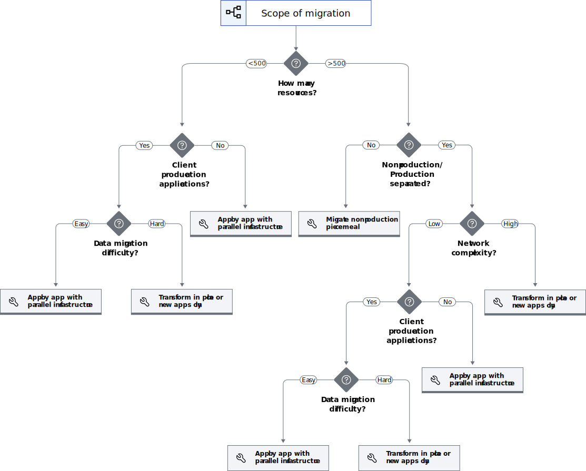

---

copyright:
  years: 2023
lastupdated: "2023-11-15"

subcollection: adopt-enterprise-architecture

keywords:

---

{{site.data.keyword.attribute-definition-list}}

# Determining your adoption strategy
{: #migration-strategy}

Adopting the enterprise architecture might include both organizational and technical transformation to achieve all the benefits.
{: shortdesc}

To determine your adoption strategy:

1. Evaluate the delta between the existing architecture and the [target architecture](/docs/enterprise-account-architecture?topic=enterprise-account-architecture-account-structure) for each group of resources. Consider your account, security posture, and level of automation.
1. Pick a strategy appropriate for the workload or related group of workloads. Use the [decision tree](#decision-tree) to help with strategy selection.
1. Consider how these changes will affect users. Reorganizing operations, security, network, and compliance expertise might be needed. Also, new cloud access procedures and operational processes might be required.

## Technical strategies
{: #technical}

On the technical side, several strategies can be considered:

* [App by App migration](./migrate/#app-by-app-migration). Migrate one workload or a group of workloads at a time into newly created workload accounts. Deploy a new set of accounts that follow the enterprise architecture recommendations. Then dual deploy workloads to both old and new infrastructure until data migration and testing is complete.
* [Piecemeal migration](./migrate/#piecemeal-migration-identity-and-access-management). Migrate individual aspects only. For example, move dev to a new structure, or adopt the IAM recommendations, or move to the recommended network architecture only. Details depend on what aspect is being migrated.
* [New applications only](./migrate-enterprise-account-architecture?topic=migrate-enterprise-account-architecture-migrate#new). Leave existing workloads alone, only new work is deployed into the new structure.
* [Transform in place](./migrate-enterprise-account-architecture?topic=migrate-enterprise-account-architecture-migrate#transform-in-place). Implement the architecture by gradually transforming existing deployments rather than migrating to a parallel set of infrastructure.
* [Hybrid](./migrate-enterprise-account-architecture?topic=migrate-enterprise-account-architecture-migrate#hybrid). For example, transform databases in place and then use an app by app approach to move workloads to a parallel infrastructure.

Each strategy has more details, including pros and cons.

## Technical strategy decision tree
{: #decision-tree}

To help with selecting technical strategies, the following decision tree can be used as a guide:

{: caption="Figure 1. Technical strategy decision tree" caption-side="bottom"}

Keep in mind that any decision tree incorporates only a few key criteria, so be sure to read up on the details of each strategy before adopting.

## Nontechnical aspects of adoption
{: #organizational }

In addition to the technical aspects of adopting the enterprise architecture recommendations, there might be impacts to individual users, procedures, and organizations that should be considered.

* DevOps users might need training on the use of [Infrastructure as Code](https://www.ibm.com/topics/infrastructure-as-code) as they transition from directly manipulating cloud resources to adopting Infrastructure as Code.
* All users might need to login to different cloud accounts and potentially learn how and when to use trusted profiles as the centralized administration model is adopted.
* DevOps procedures and runbooks might need to be updated to align with new network models, centralized administration, IaC, and so on.
* Development and DevOps teams might benefit from reorganization so that experts in core functions such as infrastructure as code, security, networking, and compliance are located in centralized teams that are responsible for developing and maintaining the deployable architectures for shared infrastructure.
* Operations teams might benefit from reorganization so that operations experts are located in centralized teams that operate the shared infrastructure.
